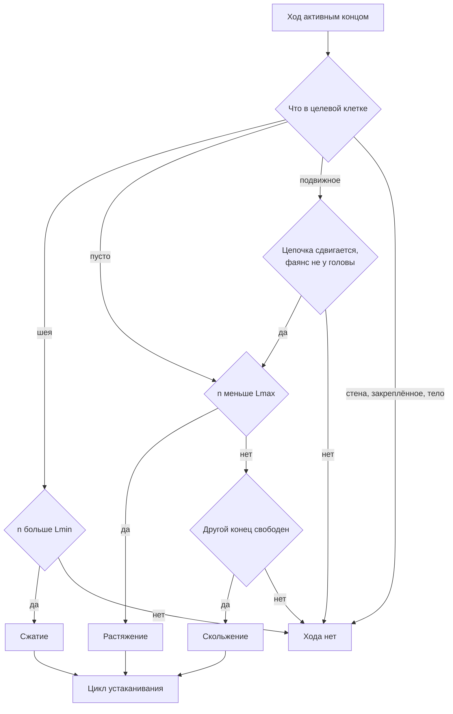

# Лапидус. Ни капли — дизайн-документ и промпт сборки

Sep 23, 2026 · @Lao · в репозитории с ревизии 18; правка 28–29.09: ворота качества и мерка новичка §7, кв. 3 и 6 §6, напор §4

## Как читать

Документ — одновременно геймдизайн и ТЗ на автономную сборку: после согласования я собираю игру строго по нему, без вопросов и заглушек.

- Разделы 1–10 — сама игра; 11–14 — техника, сборка и приёмка; 15 — открытые решения (везде стоит дефолт); 16 — команда запуска.
- Всё, что помечено «черновик», финализирует солвер на этапе сборки: раскладки уровней не рисуются на глаз.
- Правьте прямо в тексте или оставляйте комментарии — я вношу изменения и поднимаю версию.

## 1. Питч

«Лапидус. Ни капли» — коварная головоломка на 10 уровней: Лапидус стал самоходной гофрой и собирает водопровод, в котором недостающее звено — он сам.

| Источник | Что берём | Что меняем |
| --- | --- | --- |
| Snakebird | Тело-змейка, гравитация, толкание, тело как опора для себя и предметов | Длина не растёт от еды, а тянется и сжимается в пределах уровня, обычно 2–5 клеток; у героя два разных управляемых конца — голова и ноги |
| Jelly no Puzzle | Необратимое слипание; слипшаяся сборка падает и толкается целиком | Слипаются не одинаковые цвета, а резьбы: наружная входит во внутреннюю, только лицом к лицу |
| Своё | — | Победа — опрессовка: вода от стояка доходит до всех приборов, проходит через Лапидуса и нигде не течёт |

Детали на поле не вращаются, поэтому развернуть резьбу может только Лапидус — повернувшись всем телом. С 7-го уровня в сети появляется напор, и протечка становится инструментом: струя толкает, поднимает и мешает.

Первый уровень уже трудный, десятый — безумный. Время прохождения — оценка 3–6 часов, точную цифру даст плейтест.

## 2. Лапидус и мир

Завязка — одна немая сцена: утро, душ, голова в мыле, и воду отключают «до окончания работ». Лапидус поступает как любой разумный человек: становится гофрой и идёт давать воду сам.

Это спин-офф вне основной линии «Латунного янычара»; сюжет BJ3 не затрагивается. Голова в мыле всю игру: пену смывает только полный напор, и случается это в финале.

Облик героя:

- тело — белая гофра, густота рёбер показывает, насколько он растянут;
- голова — сам Лапидус, как в каноне серии: лысеющий усатый брюнет с мыльной пеной на макушке; рот — латунное гнездо с внутренней резьбой: прикручиваясь, Лапидус буквально вгрызается в трубу;
- ноги — латунный штуцер с наружной резьбой и пальцами;
- активный конец живой, неактивный спит: глаза закрыты, пальцы поджаты.

Мир — один подъезд пятиэтажной хрущёвки в разрезе: 5 этажей, в кадре по две квартиры на этаж, уровни идут снизу вверх. Меню — в подвале, у главного вентиля дома. Квартиры 1–6 чинятся всухую; на 7-й воду дают прямо во время работ, и чем выше этаж, тем слабее напор.

- Жильцы молчат: каждый уровень кончается немой сценкой в квартире (§10).
- Подсказки даёт горячая линия управляющей компании — голос автоответчика.
- У приборов есть лица, но они только гримасничают, без реплик.

Рейтинг 18+, как у серии: в финале наготу прикрывает пар, мат редкий и только как пунктуация.

## 3. Правила ядра

Поле — вид сбоку, сетка до 16×10; правила полностью детерминированы: ни таймингов, ни случайности.

### Клетки и объекты

| Объект | Двигается | Резьбы | Роль |
| --- | --- | --- | --- |
| Стена | Нет | — | Опора и препятствие |
| Слив | — | — | Всё, что в него попало, «смыло» |
| Стояк | Нет | 1–3 выхода | Источник воды, всегда открыт |
| Прибор: ванна, унитаз, мойка | Нет | 1 вход | Цель: должен получить воду |
| Глухой отвод | Нет | 1 | Сухая резьба в стене, точка крепления |
| Латунная деталь: муфта, угольник, тройник, заглушка | Да | 1–3 | Строительный материал |
| Фаянс | Да | Нет | Груз и ступенька; головой не толкается |
| Лапидус | Сам | 2 конца | Герой и недостающее звено |

Закреплённое — стояк, приборы, глухие отводы и всё, что к ним прикрутилось. Подвижное — всё остальное, кроме Лапидуса.

### Резьба

Каждая сторона детали — пустая, с наружной резьбой (Н) или с внутренней (В). Если в соседних клетках Н и В смотрят друг на друга, они свинчиваются сразу, в том числе на лету при падении.

| Кто с кем | Результат |
| --- | --- |
| Подвижное + подвижное | Навсегда одна жёсткая сборка |
| Подвижное + закреплённое | Сборка навсегда закреплена |
| Конец Лапидуса + закреплённое | Конец прикручен: это якорь |
| Конец Лапидуса + подвижное | Ничего: болтающееся к Лапидусу не крепится |
| Голова + ноги | Ничего |

Раскрутить можно только Лапидуса: прикрученный конец откручивается, когда им делают ход. Всё остальное — навсегда.

### Лапидус

Тело — цепочка из n клеток; n лежит в пределах уровня от Lmin до Lmax, и Lmin не меньше 2. Голова — гайка с резьбой В, ноги — штуцер с резьбой Н; резьба конца смотрит наружу, прочь от соседнего звена. Управляется один конец, смена конца бесплатна и ходом не считается.

| Что в целевой клетке | Условие | Результат |
| --- | --- | --- |
| Шея — соседнее звено | n больше Lmin | Сжатие: конец втягивается, n − 1 |
| Пусто | n меньше Lmax | Растяжение: новое звено, n + 1 |
| Пусто | n = Lmax, другой конец свободен | Скольжение: тело ползёт следом, длина та же |
| Пусто | n = Lmax, другой конец прикручен | Нельзя: натянут |
| Подвижная сборка | Цепочка может сдвинуться | Толчок цепочки на клетку, затем как «Пусто» |
| Стена, закреплённое, своё тело | — | Нельзя |

- Ход атомарен: сначала проверяется всё, потом исполняется. Если конец не сможет занять освободившуюся клетку, ничего не толкается.
- Толкается вся цепочка подвижных сборок перед концом. Если хоть одна клетка упрётся в стену, закреплённое или тело Лапидуса, хода нет.
- Голова не толкает фаянс прямо перед собой: мыло скользит. Через латунную деталь — можно.
- Лапидус ничего не носит: лежащее на нём не едет вместе с ним и только падает, потеряв опору.

### Опора и падение

Предмет стоит, если хоть одна его клетка лежит на стене, на закреплённом или на том, что стоит само. Лапидус стоит так же — или если прикручен хоть один конец. Всё, что не стоит, падает целиком, не прогибаясь.

### Цикл устаканивания

После каждого хода три шага повторяются, пока всё не замрёт:

1. Резьба: все пары Н и В лицом к лицу свинчиваются.
2. Струи, только при напоре (§4): толкают на одну клетку.
3. Гравитация: всё, что не стоит, одновременно падает на одну клетку.

Попавшее в слив «смыло». Если смыло Лапидуса — это поражение: уровень ждёт отмены.



Все проверки идут до исполнения: толчок случается, только если конец затем может занять клетку.

### Вода и победа

Мокрая сеть — всё закреплённое, связанное резьбами со стояком. Если конец Лапидуса прикручен к мокрому, вода идёт через него насквозь и мочит то, к чему прикручен второй конец.

Открытая резьба на мокром — протечка, включая неиспользованные выходы стояка и свободный конец мокрого Лапидуса. Без напора она капает, с напором бьёт струёй (§4).

Победа проверяется после устаканивания:

- все приборы мокрые;
- нет ни одной протечки;
- Лапидус на маршруте: без него хотя бы один прибор остался бы сухим.

## 4. Расширения: напор и гребёнка

С 7-го уровня в сети есть напор R от 1 до 3, и каждая протечка бьёт струёй длиной R клеток; на уровнях 1–6 напор нулевой. Напор показывает манометр у стояка, он задан уровнем и не меняется.

- Струя идёт из открытой мокрой резьбы вдоль её оси на R клеток — до первой стены, закреплённой детали или прикрученного Лапидуса.
- Подвижную сборку и неприкрученного Лапидуса в струе толкает на клетку за шаг цикла по обычным правилам цепочки, пока не вытолкнет.
- Струя вверх — столб: всё внутри него и на клетке над верхушкой стоит. Это лифт.
- Резьба сильнее струи: деталь с подходящей резьбой, вошедшая в первую клетку струи — сбоку или вдавленная толчком сверху, — прикручивается и затыкает протечку; течь переходит на её свободный выход. Упавшую сверху деталь фонтан держит на весу: сама она его не заглушит.
- Правила напора показывает игроку карточка «8 · Струя толкает и держит» на экране заявки кв. 7: манометр — длина струи, струя вверх держит, струя толкает, резьба сильнее струи.
- Каждая струя действует на сборку один раз. Встречные толчки гасят друг друга, а при толчках по двум осям действует только вертикальный.
- Свободный конец Лапидуса, прикрученного другим концом к мокрой сети, сам бьёт струёй туда, куда смотрит. Это брандспойт: им можно целиться, своя струя его не толкает.
- Толчки внутри шага исполняются в фиксированном порядке: сверху вниз, слева направо. Если цикл не замер за 64 шага, солвер бракует уровень ещё на сборке.

Запасной вариант, если физика струй не пройдёт плейтест: толкают только струи вверх.

Гребёнка — закреплённый коллектор с 3–4 выходами: каждый неподключённый выход после намокания становится протечкой. На уровнях 9–10 приборов несколько.

Резерв вне основных 10 уровней: горячая и холодная сети, смеситель с двумя входами (смешал сети — провал) и крестовина с двумя независимыми каналами. Это кандидат в бонусный уровень или версию 1.1 (§15).

## 5. Управление и UX

Отмена безгранична, рестарт тоже отменяется; счётчик показывает число ходов в текущей истории, смена конца не считается.

| Действие | Клавиатура | Геймпад и Steam Deck | Тач |
| --- | --- | --- | --- |
| Ход активным концом | Стрелки или WASD | Крестовина или стик | Свайп — одна клетка |
| Сменить конец | Tab или пробел | A | Тап по другому концу |
| Отмена | Z или Backspace | B, удержание — быстро | Кнопка ↶ |
| Рестарт | R | Y | Кнопка ⟲ |
| Подсказка | H | X | Кнопка ? |
| Меню | Esc | Start | Кнопка ≡ или системная «Назад» |

Мышью конец можно тянуть. На телефоне — только альбомная ориентация, экранная крестовина по желанию, вырезы экрана учитываются через безопасную зону.

Подсказки — горячая линия управляющей компании, три ступени:

1. Одна фраза про ключевую идею уровня, без ходов.
2. «Я в тупике?» — честный ограниченный поиск из текущей позиции: «да», «нет» или «не знаю».
3. «Вызвать мастера» — показ оптимального решения; если из текущей позиции его не найти, мастер начинает с рестарта.

Обращения на горячую линию записываются в акт выполненных работ.

Обучение без текстовых туториалов (принято Lao 29.09.2026): по одному новому правилу на квартиру, смысл которого виден сразу.

- Новое правило вводится в своей квартире вкладышем на экране заявки: одна карточка с немыми пиктограммами в духе инструкции к мебели и ГОСТа.
- Что можно показать последствием, показывается последствием, без карточки: падение (Лапидус падает на глазах) и смыв («Канализация приняла. Отмена — Z»). Отмена бесплатна.
- Первая встреча с новым элементом на поле безопасна: проигрыш от него виден сразу.
- «Паспорт изделия» — справочник в меню, не обязательный экран: его страницы — те же вкладыши, страница открывается вместе со своей квартирой (падение и смыв — после решения кв. 1).

| Кв. | Вкладыш |
| --- | --- |
| 1 | «Н входит в В — вода до прибора»; после решения в паспорте — «Без опоры падает, резьба держит» и «Слив смывает» |
| 2 | Нет: крюк — сталь с хомутом; что латунь прикручивается сразу и навсегда, и на лету тоже, игрок видит первым же ходом (02.10: «Вешалка») |
| 3 | «Лишний выход — заглушить» |
| 4 | «Деталь падает и свинчивается» (и «намертво» — прикрученная к сети становится сталью) |
| 5 | Нет («Звено» — ядро на известных правилах) |
| 6 | Нет («Кругом!», 03.10) |
| 7 | «Фаянс толкают только ноги» |
| 8 | «Поднимает, но не носит» (перенесён из кв. 10, 02.10) |
| 9 | Нет |
| 10 | Нет (вкладыш перенесён в кв. 8) |

Состав вкладышей пересчитывается, если меняется список квартир; принцип остаётся.

Одновременно открыты два нерешённых уровня. Разряд за уровень считается от оптимума солвера:

| Разряд | Ходов сверх оптимума |
| --- | --- |
| 6-й | 0 |
| 5-й | До 10% |
| 4-й | До 25% |
| 3-й | До 50% |
| 2-й | Больше 50% |

Значок «Золотые руки» — все 10 уровней на 6-м разряде без подсказок. Прогресс и незаконченный уровень вместе с историей отмен сохраняются автоматически.

Доступность: Н и В различаются формой, а не только цветом; есть режим высокого контраста; каждый звук продублирован визуально; реакции на время нет.

## 6. Уровни 1–10

Каждый уровень держится на одном «ага», которое формулируется одной фразой. Раскладки — черновик: их финализирует солвер (§7), идея уровня при этом не меняется.

Самобытные механики — то, чего нет ни в Snakebird, ни в Jelly no Puzzle; «ага» каждого уровня стоит на одной из них (ворота §7):

| № | Механика |
| --- | --- |
| M1 | Два конца с разной резьбой (голова В, ноги Н): кем зацепиться и каким концом войти в прибор, предрешено резьбой |
| M2 | Якорь: конец держит в воздухе на чужой резьбе и откручивается ходом — разворот в воздухе, лазанье |
| M3 | Переменная длина и «натянут»: от якоря дотянуться не дальше Lmax−1 |
| M4 | Резьба направленная, детали не поворачиваются: порядок и ориентация деталей на полу — навсегда |
| M5 | «Окаменение»: прикрученная к сети деталь навсегда занимает порт и становится новым якорем |
| M6 | Цель — сеть без протечек: каждый открытый выход мокрого надо закрыть; Лапидус — звено с фиксированной ориентацией |
| M7 | Не носит, но ловит: поднять можно только то, что лежит на самом Лапидусе |
| M8 | Асимметрия концов у фаянса: голова скользит, толкают только ноги |
| M9 | Напор: струя толкает и держит, резьба сильнее струи, брандспойт, прикрученный Лапидус обрывает струю |
| M10 | Гребёнка: намокшая ветка рождает протечки; два прибора |

| № | Квартира | Новое | Ключевая идея | Поле · длина · напор |
| --- | --- | --- | --- | --- |
| 1 | «Не той стороной» | Все глаголы Лапидуса | Лежит задом наперёд, а развернуться может, только повиснув на чужой резьбе: сначала прикрутить «не тот» конец | 10×7 · 2–4 · 0 |
| 2 | «Вешалка» | Якорь и досягаемость; первая латунь | Муфту на стояк столкнёшь, только повиснув на крюке: с пола не дотянуться (M2/M3); крюк нужен самому — отдать его муфте (она прикипает на лету) и есть ловушка. Муфта: груз → звено-якорь (M5). Сменила «Скалолаза» (build/l2e), раунд build/l2k | 8×9 · 2–4 · 0 |
| 3 | «Лишний выход» | Тройник, заглушка | Заглушка — единственная ступенька наверх: сначала лестница, потом пробка | 12×8 · 2–5 · 0 |
| 4 | «Резьба» | Подвижные детали | Собранная заранее труба не пролезает: детали надо ронять в строгом порядке, чтобы они свинтились на лету на своём месте | 9×8 · 2–4 · 0 |
| 5 | «Звено» | Лапидус — кусок стояка | Между окаменевшими деталями ровно его минимальная длина: голова к ниппелю, ноги втягиваются на муфту (M1/M5/M6). Муфта: табуретка под лазом → звено-крюк на стояке; вкрутить её сразу естественно и необратимо, видно через 8–10 ходов. Сменила напорную «Дали напор» (резерв, build/l7f); раунд build/l6j | 10×9 · 4–5 · 0 |
| 6 | «Кругом!» | Место для разворота | Развернуться надо в колодце, пока он пуст: упавший угольник займёт угол, без которого не развернуться — детали встают на верные места, а Лапидус оказывается концами наоборот («правильные детали, неправильный Лапидус», M1/M3). Скептик: принять как лёгкую квартиру середины. Сменила «Зазор» (резерв, build/l7j/installed_zazor_level4.lua); раунд build/p6/neck | 9×6 · 4–6 · 0 |
| 7 | «Мыло» | Фаянс | Нижнее мыло — не ступенька, а подставка: его выбивают ногами в слив из-под верхнего | 11×8 · 2–5 · 0 |
| 8 | «Гусеница» | Не носит, но возит | Муфта едет на спине: один конец подталкивает, другой подстилается впереди (M7, M3); под стояком её провозят низом — поверху она прикипает на лету и не хватает звена (M1/M6). Сменила напорную «Гребёнку» (резерв, build/l9a); раунд build/l8j | 10×8 · 2–5 · 0 |
| 9 | «Домкрат» | Лапидус поднимает деталь | Тройнику место под колонкой, а не на стояке: Лапидус ловит его на себя и выжимает вверх, затем сам становится стояком вверх ногами (M7, M1, M5, M6); ловушка — заглушить тройник на полу, «бутерброд» в шахту не пролезет. Класс «вводный+»: полные ворота — структурный предел без напора (раунд f). Сменила «Опрессовку» (резерв, build/l10a); раунд build/l9j | 9×9 · 3–6 · 0 |
| 10 | «Намертво» | Свинченная пара — одно тело; карточка «Поднимает, но не носит» | Ниппель — не в колонку, а за спину муфте: через двойной слив они пройдут только парой, муфтой вперёд (порядок деталей на полу — навсегда) | 11×5 · 3–5 · 0 |

Порядок квартир (решение Lao 02.10, по единому замеру build/p4/check_all.txt и субъективной оценке «ага»; старые номера в
скобках): 1 (1) → 2 (2) → 3 (5) → 4 (3) → 5 (4) → 6 (7) → 7 (8) → 8 (9) → 9 (10) → 10 (6). 03.10 (внешнее ревью, решение Lao):
«Зазор» и «Мыло» поменялись местами — «Зазор» легче «Звена», а «Мыло» готовит опоры и груз «Гусеницы» (4 ↔ 7). Ввод элементов сохранён:
резьба и крюк → досягаемость → тройник и заглушка → фаянс → свинчивание на лету → напор → брандспойт → гребёнка → синтез →
финал «Намертво» — единственный уровень полных ворот, по цифрам сильнее всех (глубина 29, 11 дверей с пути, 67 %).

Номер уровня совпадает с номером квартиры: этажи с 1-го по 5-й, по две квартиры, снизу вверх.

Правила дизайна уровней:

- не больше 8 подвижных деталей: глубина вместо количества;
- «ага» уровня формулируется одной фразой — она же первая подсказка;
- первое очевидное действие ведёт в правдоподобную ложную ветку;
- всё видно на экране, правил сверх вкладышей нет — доктрина честности Гилберта;
- одно новое правило на квартиру, и его смысл читается с первого взгляда.

## 7. Сложность: метрики и солвер

Сложность не оценивается на глаз: каждый уровень проходит через солвер, который исполняет то же ядро правил на Lua, что игра и автоплей.

| Метрика | Как считается | Что показывает |
| --- | --- | --- |
| Минимум ходов | BFS по состояниям; смена конца — не ход | Длину решения |
| Достижимые состояния | Полный BFS с потолком 5·10⁶ | Ширину поиска |
| Доля тупиков | Состояния, из которых победа недостижима | Коварство |
| Ложные ветки | Тупиковые области от 50 состояний в одном ходе от оптимального пути | Правдоподобные ловушки |
| Абляция | Ключевой трюк отключён — уровень обязан стать нерешаемым | Что трюк обязателен |
| Единственность | Все выигрышные конечные конфигурации; если их больше одной — разбор вручную | Нет ли лазейки |

Стартовые коридоры:

| Уровень | Минимум ходов | Состояний, не больше | Тупиков, не меньше | Ложных веток, не меньше |
| --- | --- | --- | --- | --- |
| 1 | 18–30 | 2·10⁴ | 25% | 1 |
| 2 | 22–38 | 5·10⁴ | 30% | 2 |
| 3 | 25–45 | 1·10⁵ | 35% | 2 |
| 4 | 30–50 | 3·10⁵ | 40% | 2 |
| 5 | 35–60 | 5·10⁵ | 45% | 3 |
| 6 | 40–70 | 1·10⁶ | 50% | 3 |
| 7 | 45–75 | 1·10⁶ | 50% | 3 |
| 8 | 50–85 | 2·10⁶ | 55% | 4 |
| 9 | 60–100 | 3·10⁶ | 60% | 4 |
| 10 | 90–150 | 5·10⁶ | 70% | 6 |

Цикл: идея → ASCII-раскладка → солвер → метрики → правка, пока уровень не попадёт в коридор. Мутатор перебирает вариации авторского скелета — сдвиги деталей, длины, напор — и предлагает лучших кандидатов.

Коридоры — стартовые цифры: человеческую сложность подтверждает только плейтест автора. Решения хранятся лишь в puzzles/solutions.json и WALKTHROUGH\_SPOILERS.md и не попадают в чат и отчёты.

### Ворота качества (приняты Lao 24–26.09.2026)

Коридоры выше — ориентир; уровень принимается, только когда проходит все ворота. Проверка — `luajit build/l6b/check.lua <файл>`
(все ворота разом) и `luajit tools/review.lua N`.

| Ворота | Порог | Что значит |
| --- | --- | --- |
| Наобум | ≤ 1 % за 1000 ходов | Случайный игрок с откатом после «смыло» и «Заново» после 5×нормы почти не проходит (solver/strict.lua) |
| Ширина коридора кратчайших решений | ≤ 3 | Разные решения — только локальные перестановки |
| Скрытые тупики | ≥ 40 % от скрытых и живых | Выиграть уже нельзя, а видимо ничего не потеряно |
| Умная обезьяна | ≤ 0,1–0,2 % за 1000 ходов | Случайный игрок, не делающий видимо проигрышных ходов |
| Глубокая ложная ветка | ≥ 1 скрытая ветка глубиной ≥ 8 ходов, вход с кратчайшего пути | Правдоподобная ошибка вскрывается не сразу |
| Ошибка из подсказки №1 | Достижима в игре и ведёт в скрытый тупик | «Ага» — решение игрока, а не описание маршрута |
| Прогулка | ≤ 5–6 ходов пути подряд без событий с деталями | Нет пустой логистики |
| Вынужденные ходы | ≤ 3–4 подряд | Нет коридора без выбора |
| Абляция роли | Фильтр ходов, запрещающий именно ключевой приём → нерешаем | Доказывает роль приёма, а не только нужность детали |
| Единственность | Одна выигрышная конфигурация | Нет лазейки |
| Двери (30.09) | С кратчайшего пути в скрытые тупики ведут входы и в первой, и во второй половине пути; каждый — ошибка плана глубиной ≥ 8, а не блуждание | Игрок ошибается не один раз в начале |
| Замуровка (30.09) | Клетки и элементы, без которых решение и абляции не меняются, — мёртвое пространство; цифра скрытых считается после их замуровки. Исключение — приманка: элемент, через который проходит дверь (ход из живого состояния в скрытое — сам ошибочный выбор игрока); приманка не мёртвое пространство, а место для деталей или Лапидуса внутри уже проигранных состояний — мёртвое | Доля скрытых не раздута местами для деталей внутри тупиков |

Видимый проигрыш уровня (`def.visibleLoss`) считается **по мерке новичка** (решение Lao 29.09): игрок знает правила
(паспорт и карточки), но не решение. Видимо проиграно, если: деталь смыта (кроме уровней с `washOk`, где одна деталь
уходит в слив по замыслу); нужная деталь больше никогда не сдвинется (сокобан-угол, зажата, запечатана); деталь, которую
надо поднять, лежит там, где её нечем поднять; прибор или выход стояка навсегда заняты деталью, чья резьба явно никуда
не ведёт. Скрыто для новичка: неверный порядок деталей, неверная пара или деталь не на своём месте, если для этого нужно
знать финальную сборку. Разметка считается общей линейкой `tools/vislib.lua` (её используют build/l6b/check.lua, tools/review.lua и
build/l6b/fate.lua): «нужная деталь больше никогда не сдвинется» определяется по графу состояний одинаково для всех
уровней, а def.visibleLoss уровня может только добавлять правила. Сужать разметку ради метрик нельзя; каждого
кандидата перепроверяет слепой скептик (получает файл уровня, а не отчёт автора). Мерка «знатока»
(плюс всё, что противоречит единственной финальной сборке, и проигрыш, вскрывающийся следующим толчком) считается
для сведения и пишется в отчёт уровня; в общей линейке она — сравнение с финальной сборкой (деталь прикручена не туда,
пара свинчена иначе) и «любой следующий ход вскрывает проигрыш».
Коридор ходов (решение Lao 29.09): 15–40 ходов при ≥ 2 ключевых событиях; таблица стартовых коридоров выше — справочно.

Пороги по типу уровня (решение 29.09, пересмотр п. 3, build/p3/REVIEW.md): уровень **без подвижных деталей** — скрытых
тупиков ≥ 25 %, «умная обезьяна» и «наобум» для сведения (пространство < 300 состояний исчерпывается случайным игроком
независимо от качества); уровень **с деталями** — ≥ 40 %, обезьяна ≤ 0,2 %. Порог под конкретную квартиру не снижается:
35–39 % — «near», докладывается Lao отдельно.

Пересмотр ворот по итогам шести пар «автор — слепой скептик» (30.09, кв. 2, 4, 7; build/p3/REVIEW.md п. 6): у плотного
уровня с 2–3 деталями честная доля скрытых тупиков структурно 25–35 % (k29/k40/t16 кв. 4: 33 / 33 / 35 %) — «окаменение»
делает видимой почти любую ошибку с прикручиванием, а всё сверх этого набиралось мёртвым пространством, нишами и порогом
кармана. Поэтому с 30.09 качество меряется ошибками плана, а доля — только нижняя граница (утверждено Lao 30.09):

| Ворота (30.09) | Порог |
| --- | --- |
| Ошибки плана | ≥ 2 независимых, со входом с кратчайшего пути, хотя бы одна во второй половине пути |
| Стойкость ошибки | каждая держится скрытой ≥ 4–6 ходов естественного продолжения ложного плана (не максимум блуждания) |
| Несущность | запрет каждой ошибки (фильтр) заметно облегчает уровень; подзадачи связаны между собой, а не лежат рядом |
| Скрытые тупики | ≥ 25 % после замуровки мёртвого пространства, при кармане 4 и без скачка при 5 |
| Остальное | как выше: обезьяна, наобум, ширина, прогулка, единственность, абляции, самобытность |

Два класса уровней (решение Lao 01.10.2026, вариант А — после перекрёстных проверок кв. 3 и 8 двумя моделями, build/p3/REVIEW.md):
в нынешних правилах скрытые ошибки плана надёжно даёт только порядок и ориентация деталей (M4/M5); напор, фаянс и заглушка дают
«ага», но ошибки в них видимы или обратимы. Поэтому:

| Класс | Квартиры | Что требуется |
| --- | --- | --- |
| Вводные | 1, 2, 3, 4, 5, 7, 8 | «ага» на своей механике; ≥ 1 скрытая ошибка плана со входом с кратчайшего пути, стойкость 4–6 ходов; обезьяна ≤ 0,2 %; ширина ≤ 3; прогулка ≤ 6 (кв. 3: 9 — структурно, записано исключением); единственность; абляции узкие; скрытых ≥ 25 % после замуровки — желательно, не обязательно |
| Полные ворота | 6, 10 (решение Lao 02.10: кв. 9 после двух раундов — near, полные ворота перенесены на кв. 10, которая строится на порядке деталей M4/M5; кв. 8 — поиск в 16×10 закрыт) | таблица ворот 30.09 целиком |

Итог по планке на 02.10.2026 (честно): из десяти квартир полные ворота 30.09 проходит одна — финальная «Намертво»
(глубина 29, 11 дверей с пути, 67 %). Остальные девять — «одно „ага“ + одна глубокая ошибка плана + исполнение»: не проходятся
наобум (обезьяна ≤ 0,2 % везде, кроме кв. 1 — там пространство 211 состояний), у каждой своя механика, но ощущения «завалил всё
на двадцатом ходу» в них нет. Причина измерена четырьмя независимыми поисками (кв. 7–10, две модели в ролях автора и скептика,
~200 кандидатов): в нынешних правилах скрытые ошибки плана надёжно даёт только порядок и ориентация деталей (M4/M5); ошибки
напора, брандспойта, гребёнки и фаянса видимы или обратимы, а короткая прогулка и двери второй половины в плотных раскладках
взаимоисключают друг друга. Путь к «безумной» десятой — не новые раскладки, а новый механизм правил (§15, резерв): например,
прикрученная деталь как новая точка отсчёта досягаемости; резьба, которую можно раскрутить один раз; намокший порт, который
перестаёт принимать. Решение — после реакции тестеров.

Ворота 03.10 (решение Lao после внешнего ревью головоломок; заменяют приёмочную роль ворот 30.09). Ядро правил не трогаем.
Ревью показало, что «структурный предел» был пределом узкого поиска (скрытый необратимый тупик в нужной половине пути), а не
правил; модель правил ревьюера совпала с движком (оба его прототипа дали те же длины, build/p6).

| Что | Статус |
| --- | --- |
| «Ага» одной фразой; абляции элемента и роли — нерешаемо; обезьяна ≤ 1 %; нет лазейки, обходящей идею | Приёмка для всех уровней |
| **Два связанных открытия:** после первого существенного открытия нужно второе, не выводимое из первого автоматически; состояние после первого — инструмент второго, последнее закрепление уничтожает эту возможность | Приёмка для финала и предфинала (вместо «две ошибки, одна после середины») |
| Доля скрытых, ширина, прогулка, двери по половинам пути, «наобум» | Диагностика в отчёт, не приёмка. Ширину делить на варианты управления и разные стратегии; прогулку — отдельно от содержательной перестройки тела |
| Одна выигрышная конфигурация | Допустимы эквивалентные финалы, выражающие одну идею |
| Мерка знатока | Контроль: если после показа финальной сборки уровень исчезает, его задача — найти сборку (норма для вводных); глубина исполнения ценится отдельно |

Новая тема поиска (03.10): «правильные детали, неправильный Лапидус» — для подключения нужна не только клетка конца, но и клетка
«шеи» по оси порта; сторона входа и ведущий конец. Метод: сначала доказать зависимость подзадач на просторной карте, потом ужимать.
Протокол ревью: тестеру — только правила и карты; замысел, «ага», ложные планы и метрики — после попытки (бриф 03.10 эту утечку
содержал: §3.6 раскрывал все «ага»).

Ворота «самобытность»: «ага» уровня опирается на механику, которой нет у прототипов (таблица в §6: M1–M10). Приём, целиком
переносимый в Snakebird или Jelly no Puzzle (ступенька, мост, толчок блока), может быть логистикой уровня, но не его «ага».

Урок Jelly no Puzzle (02.10.2026, разбор docs/Jelly_no_Puzzle_All_Levels_Annotated_RU.pdf, 40 уровней Windows пересчитаны
перебором — build/p5/jelly_principles.md). Замечание Lao: «все уровни по сути простые, сложность мнимая — нагромождением деталей
и механик». Что показал разбор:

- один набор правил на 110 уровней; поле не растёт (50–88 клеток), элементов 5–6 в начале и 9–13 в самых трудных;
- растёт длина вынужденной цепочки ходов (с 4–20 до 35–85) и число ролей, которые одно желе играет по очереди
  (ступенька → мост → пробка → цель); тупиков 87–99 % уже с первого уровня — это условие, а не мера сложности;
- новая механика (закрепление, чёрные, сцепки, скрытые) вводится по одной, на коротком уровне, и совмещается только потом;
- «нерешаемость» — цель видна, но недостижима; очевидная склейка — ловушка; нужное средство — чужая деталь; симметрия прячет
  несимметричное решение.

Вывод для Лапидуса: ворота «самобытность» в прежнем виде вели не туда — по одной новой механике на квартиру дали десять
вводных и ни одной глубокой. Движок уже содержит все примитивы Jelly: необратимая свинчивание подвижного с подвижным,
окаменение у сети, гравитация, толчок цепочки, фаянс как груз. Планка переделки — «ворота Jelly»: ядро уровня строится на
правилах §3 (резьба, окаменение, гравитация, толчок), детали — инструменты с несколькими ролями по очереди; новых механик
на квартиру — не больше одной, и не раньше кв. 6; длина вынужденной цепочки растёт к финалу, а не число элементов.
Самобытность (условие Lao 02.10: «мы не делаем клон Jelly, самобытность идей помимо сеттинга»): «ага» каждой квартиры
опирается на то, чего у Jelly нет, — Лапидус сам звено с резьбой на концах (M1–M3, M5–M7): якорь и разворот в воздухе,
«натянут», герой как часть готовой сети, окаменевшая деталь как новая точка отсчёта. Приёмы Jelly (мост, ступенька,
пробка, подвижный пол, «не склеить раньше времени») — второй слой: они делают цепочку длинной, но не заменяют «ага».

## 8. Арт-дирекшн

Стиль — cel-shaded мультфильм, нарисованный кодом: SVG-генераторы превращаются в PNG при сборке, а весь текст рисует движок поверх чистого арта.

Читаемость важнее красоты: фон приглушённый и холоднее, всё интерактивное — насыщенное и с контуром. По мокрым трубам бежит полоска воды.

Главный вопрос игрока к предмету — «сдвинется ли это?»; ответ даёт материал, а не текст (принято Lao 29.09.2026, макет — docs/img/mock_lang.png):

| Класс | Как выглядит | Что значит |
| --- | --- | --- |
| Сеть: стояк, трубы, отводы-крюки, порты приборов | Серая сталь и чугун, хомуты с болтами, без тени | Не сдвинется никогда |
| Подвижная деталь | Яркая латунь, мягкая тень на полу | Лежит; падает, толкается, едет |
| Деталь, прикрученная к сети | За ~0,3 с «каменеет»: латунь → сталь, тень исчезает; отмена возвращает латунь | Теперь часть сети |
| Свинченная пара, деталь на Лапидусе | Остаётся латунью | Двигается вместе |
| Фаянс | Белый глянец с лицом | Толкают только ногами |

Резьба на 20 % толще, чем в первой версии арта, — чтобы Н и В читались на телефоне. Сталь в арте — фильтр steel (art/screens2.py), в движке — тот же сдвиг цвета шейдером (game/board.lua).

| Роль | Цвет |
| --- | --- |
| Латунь | #C99A2E, блик #F6DB8A, тень #7A5A14 |
| Гофра | #F2EFE6 |
| Фаянс | #FBFBF8 |
| Вода | #2EC4F1 |
| Пена | #FFFFFF |
| Контур | #2B2118 |
| Плитка | Приглушённая, своя в каждой квартире: мятная, голубая, горчичная |
| Стены | Классическая зелёная панель на 2/3 высоты |

- Резьба Н — торчащий штуцер с витками, В — утопленное шестигранное гнездо; они различаются даже в оттенках серого.
- Тело Лапидуса — непрерывный гладкий шланг через центры клеток, а не квадраты; рёбра гофры сгущаются при сжатии.
- Анимации: свинчивание — пол-оборота и белый пух уплотнительной ленты; squash and stretch на каждом шаге; струи — водяные столбы с пенной шапкой; без напора протечка капает.

Экраны:

- логотип «ЛАПИДУС» — буквы из латунных труб, по которым бежит вода; единственное исключение из правила про текст: буквы здесь — геометрия в SVG-коде;
- меню — подвал с главным вентилем дома;
- выбор уровня — хрущёвка в разрезе: решённые квартиры загораются, в стояке поднимается вода;
- победа — «Акт выполненных работ» со штампом и разрядом;
- правила — вкладыши на экране заявки; «Паспорт изделия» в меню собирает их как справочник.

Три якоря запоминаемости: герой-шланг с пенной головой, логотип из труб, загорающаяся хрущёвка.

Техника: база 1920×1080, клетка 104–120 px, чтобы поле 16×10 влезло вместе с HUD; растр 2× с mipmaps в атласе. Шрифты — OFL с кириллицей, встроенные: для интерфейса Jura или PT Sans Narrow, рукописный — Caveat или Neucha; лицензии и кириллицу подтверждаю на фазе 0. Гейты: magenta-фолбэк и скан всех скриншотов, контраст текста по WCAG не ниже 4,5:1, хитбоксы по пиксельным данным.

### Детали, слив, протечка (03.10.2026, замечание Lao)
- Фитинги в пропорциях настоящих (сверено с фото латунных фитингов): муфта — гладкий цилиндр с раструбами, ниппель —
  шестигранник и тонкая наружная резьба, угольник — гнутое литое колено, тройник — сквозная труба с отводом, заглушка —
  пробка с шестигранником или колпачок. Всё внутри клетки (±0.47): детали не залезают на стены и соседей (art/parts.py).
- Приборы вписаны в 0.80×0.92 клетки и отодвинуты от входа; подводка прибора — короткая, на свободном краю клетки.
- Слив — прежний (круглая решётка в перспективе и водоворот, как на пиктограммах): трап в разрезе Lao забраковал 03.10.
- Протечка — водяная пена у открытой резьбы (выбор Lao 03.10: «пышная шапка без ножки»): клубы бурлят, с краёв падают
  капли-слёзки; одна и та же пена для любого направления выхода (спрайт foam, art/parts.py; Board:fountain).

### Поле и проба Blender (03.10.2026)
- Поле занимает весь экран, кроме узких колонок HUD (слева 270, справа 170 px; HUD ужат на 15 %); внешняя стена — на
  полклетки, нижний ряд со сливами целиком; клетка 127–166 px вместо 120 (game/board.lua Board.geom = art/gen.py geom).
- Проба: латунные детали моделируются в Blender по настоящим пропорциям (art/blender/fittings.py) и рендерятся в 2D-виде —
  ортокамера сбоку, заливка тремя ступенями без градиентов, обводка Freestyle; резьба — вторым проходом без обводки.
  Векторные спрайты сохранены в build/blender_svg_backup/ (вернуть — скопировать обратно в assets/gfx). Решение — за Lao.

## 9. Звук и музыка

Все эффекты синтезируются кодом в OGG, лупы математически бесшовные. Музыка — три оригинальных лупа, любой заменяется своим треком из Suno.

| Событие | Звук |
| --- | --- |
| Свинчивание | Трещотка и щелчок |
| Растяжение и сжатие | Гармошка, тон вверх или вниз |
| Толчок латуни | Глухое «тум» |
| Приземление | Шлепок по весу |
| Голова о фаянс | Мыльный скрип |
| Струя | Шипение по силе напора |
| Протечка без напора | Капли |
| Натянут | Струна |
| «Смыло» | Бульканье слива |
| Победа | Водопад и короткий горн |
| Интерфейс | Щелчки |

Музыка:

- подвал — даб-бас, будто сквозь трубы;
- квартиры 1–6 — лифтовая босса-нова;
- квартиры 7–10 — та же тема плотнее, вариант «Напор»;
- горячая линия — тема в версии музыки ожидания.

Слоты описаны в манифесте: трек меняется подменой файла. Громкость музыки и эффектов — отдельные ползунки.

## 10. Юмор и тексты

Смешно должно быть в механике: каждая шутка проходит тест немой сцены и работает без единого слова.

- Текст короткий, deadpan; мат — пунктуация, а не обои.
- Модели — «Красная бурда», Monty Python, Louis C.K.; антимодели — «Аншлаг», «Кривое зеркало».
- Стоп-лист для style grep: каламбуры про стояк, «папу» и «маму», прокладку; пьяный сантехник; шутки про жену и тёщу.
- Детали называются простыми словами, жаргон никогда не шутка; в интерфейсе — пиктограммы.

| Тип текста | Объём | Образец тона |
| --- | --- | --- |
| Заявка жильца перед уровнем | До 2 строк | «Ванна есть. Воды нет. Прошу наоборот.» |
| Паспорт изделия | 1 карточка | «Гофра самоходная „Лапидус“. Длина 2–5 клеток. Совместимость с фаянсом: ногами. Гарантия на героя не распространяется.» |
| Горячая линия | 3 подсказки на уровень | «Ваш звонок очень важен для нас. Среднее время ожидания — до окончания работ.» |
| «Смыло» | 5–8 реплик | «Лапидус ушёл в канализацию. Не навсегда. Отмена — Z.» |
| Акт выполненных работ | На каждый уровень | Штамп, разряд, отметка о вызове мастера |

Ещё одна заявка — перед квартирой 2: «Сижу на унитазе третью неделю. Жду воду. Не звоните в дверь.» Названия клавиш в репликах подставляются под текущее устройство ввода.

Немые сцены после победы:

| Квартира | Сцена |
| --- | --- |
| 1 | Ванна наполняется, резиновый селезень уплывает за край кадра |
| 2 | Мужчина, три недели сидевший на унитазе, встаёт — и садится обратно |
| 3 | Полотенцесушитель сушит один носок, второй исчезает |
| 4 | Стиральная машина на отжиме уходит из кадра |
| 5 | Фонтан из унитаза пробивает потолок; сверху заглядывает сосед с ведром | (заглушка, перерисовать)
| 6 | Струя тушит сигарету жильца; он, мокрый, закуривает новую | (заглушка, перерисовать)
| 7 | Гора посуды: отмывается одна тарелка |
| 8 | Пара одновременно открывает краны одной гребёнки — у обоих по капле; немая ссора |
| 9 | Опрессовка: манометр в красной зоне, комиссия с папкой и печатью молча смотрит на единственную каплю на полу |
| 10 | Загорается газовая колонка; жилец снимает ушанку, под ней вторая |

Номера — новые (перестановка квартир 02.10). Арт: assets/gfx/scene1…scene10.png (art/screens2.py → art/export.py).
Прежний сюжет «полный напор смывает пену: Лапидус снова человек в своём душе, пар прикрывает» снят с кв. 10 и остаётся кандидатом для финальной заставки.

Стингер после титров: Лапидус с облегчением намыливает голову — и вода кончается. В кадре объявление в подъезде: «С 1 по 14 июля — опрессовка. Горячей воды не будет.»

## 11. Техническая архитектура

Движок — LÖVE 11.5 на Lua, как во всей серии: сборки под Windows, Android и iOS уже отработаны на DuckOut. 11.5 — актуальный стабильный релиз от 3 декабря 2023 года; следующая мажорная версия пока в разработке ([релизы LÖVE](https://github.com/love2d/love/releases), [репозиторий](https://github.com/love2d/love)).

| Критерий | LÖVE 11.5 | HTML5 |
| --- | --- | --- |
| Опыт серии | Весь пайплайн, гейты, мобильный прецедент | Новый пайплайн с нуля |
| Windows | Родной fused-exe | Обёртка WebView2 |
| Android | Официальный APK LÖVE со встроенной игрой | Своя WebView-обёртка |
| iPhone | Сборка в CI → TestFlight | Сразу в браузере или как PWA |
| Арт | SVG → PNG при сборке | Живой SVG |

Структура проекта:

```text
core/rules.lua    чистые правила, сериализация состояния
core/level.lua    загрузка и валидация уровней
solver/           luajit: BFS, метрики, абляции → puzzles/solutions.json
game/             сцены, рендер по журналу событий, частицы, ввод, звук, сохранения, HUD
art/              SVG-генераторы → PNG-атласы
levels/NN.lua     ASCII-сетка, объекты, тексты
tools/            автоплей, фаззер, пиксельные гейты, упаковка
```

Ядро ничего не рисует: оно возвращает журнал событий хода — сдвиг, свинчивание, падение, струя, «смыло», — а рендер проигрывает его твинами. Во время анимации буферизуется один ход. Цель — 60 fps на телефоне среднего класса.

Пример формата уровня — иллюстрация, не настоящий уровень:

```lua
return {
  flat = 1, name = "Не той стороной",
  length = {2, 4}, pressure = 0,
  grid = {            -- # стена, . пусто, ~ слив
    "##########",
    "#........#",
    "#........#",
    "#........#",
    "#........#",
    "#........#",
    "###~######",
  },
  objects = {
    {kind = "source",    at = {2, 6}, ports = {right = "N"}},
    {kind = "fixture",   what = "bath", at = {9, 6}, ports = {left = "V"}},
    {kind = "stub",      at = {5, 2}, ports = {down = "N"}},
    {kind = "porcelain", at = {7, 6}},
    {kind = "fitting",   at = {7, 5}, ports = {left = "V", right = "N"}},
    {kind = "lapidus",   cells = {{4, 6}, {5, 6}, {6, 6}}, head = 3},
  },
  texts = {request = "…", hints = {"…", "…", "…"}},
}
```

Координаты — {x, y} от левого верхнего угла; N и V в коде — это Н и В.

## 12. Сборки: что реально

Windows и Android собираю сам в песочнице. IPA собирается только на macOS, поэтому iOS-версию собирает workflow GitHub Actions и сам отправляет её в TestFlight под вашим аккаунтом разработчика.

Исхожу из того, что у вас платное членство Apple Developer Program: без него TestFlight недоступен.

| Платформа | Что получаете | Как ставить | Ограничения |
| --- | --- | --- | --- |
| Windows | Lapidus\_win64\_portable.zip: fused-exe и DLL; по желанию единый Lapidus.exe через 7-Zip SFX | Распаковать в любую папку и запустить | SmartScreen: «Подробнее» → «Выполнить в любом случае» |
| Android | Lapidus.apk на базе официального love-11.5-android.apk, подписанный моим ключом | Разрешить установку из неизвестных источников | Ключ храню: обновления ставятся поверх |
| iOS | ios-kit: исходники LÖVE 11.5 для iOS, проект игры и workflow | Workflow собирает, подписывает и загружает сборку; на iPhone ставите её через приложение TestFlight | Сборка доступна для теста до 90 дней, дальше — повторный запуск workflow |
| Steam Deck, Linux | Lapidus.love, по желанию | Через LÖVE или exe через Proton | — |

Что потребуется от вас для iOS, один раз:

1. Создать запись приложения в App Store Connect.
2. Выпустить API-ключ App Store Connect и положить его в секреты своего репозитория на GitHub — я его не вижу.
3. Запустить workflow и поставить сборку из TestFlight.

По справке Apple, ревью может понадобиться при приглашении внешних тестеров; себе вы ставите сборку как внутренний тестер ([TestFlight overview](https://developer.apple.com/help/app-store-connect/test-a-beta-version/testflight-overview)). Подпись workflow делает по API-ключу через автоматическое управление подписью Xcode; запасной путь — сертификат .p12 в тех же секретах.

Риск: Apple регулярно поднимает минимальную версию Xcode для загрузок в App Store Connect, а iOS-исходники LÖVE 11.5 вышли в 2023 году. Совместимость с актуальным Xcode раннера проверяю на фазе 0; при сбое правлю настройки сборки проекта, а не игру.

Пошаговые инструкции для всех платформ — в INSTALL\_RU.md в комплекте: каждое нажатие, без допущений.

## 13. План «в один заход»

Сборка — одна автономная сессия по фазам; журнал BUILDLOG.md подтверждает каждую фазу доказательствами. Если упрусь в лимит контекста, остановлюсь на контрольной точке и продолжу с неё по слову «продолжай».

| Фаза | Что делаю | Контрольная точка |
| --- | --- | --- |
| 0. Окружение | LÖVE 11.5, luajit, xvfb, resvg, apktool, JDK, Wine; версии фиксирую | Версии и хэши в BUILDLOG.md |
| 1. Ядро | Правила §3–§4, юнит-тесты краевых случаев, солвер | Все тесты зелёные |
| 2. Уровни | 10 уровней через цикл солвера из §7 | Метрики в коридорах; серая играбельная сборка |
| 3. Арт | SVG-генераторы, атласы, логотип | Пиксельные гейты |
| 4. Игра | Сцены, UI, звук, подсказки, сохранения | Автоплей проходит все уровни |
| 5. Проверки | Автоплей со скриншотами, фаззер 3×25 000, пиксельные гейты, достижимость текстов, стоп-лист юмора, Wine | Все гейты зелёные |
| 6. Упаковка | Сборки §12, INSTALL\_RU.md, итоговый отчёт | Все артефакты на месте |

## 14. Критерии приёмки

Сборка сдана, когда закрыты все пункты; последний требует вашего устройства и аккаунта.

- [ ] Все 10 уровней решаемы и проходят ворота качества §7 при честном видимом проигрыше; абляции роли подтверждены.
- [ ] Автоплей воспроизводит решения солвера, конечные состояния совпадают побитно.
- [ ] Фаззер 3×25 000 операций: нет наложений, число деталей сохраняется, поведение детерминировано.
- [ ] Magenta-пикселей 0, контраст текста не ниже 4,5:1.
- [ ] Все тексты достижимы, стоп-лист юмора чист.
- [ ] Тач, клавиатура и геймпад работают; ориентация только альбомная.
- [ ] Windows-сборка запускается под Wine из «C:\\Игры\\Лапидус тест\\».
- [ ] APK проходит проверку подписи; «Назад» открывает меню.
- [ ] Workflow iOS проходит статическую проверку.
- [ ] Ни одного решения в чате и отчётах.
- [ ] На вашей стороне: APK на телефоне, первая сборка в TestFlight, 60 fps на реальных устройствах.

## 15. Открытые решения

Если ничего не менять, собираю по колонке «Дефолт».

| Вопрос | Дефолт | Альтернатива |
| --- | --- | --- |
| Облик героя | Гофра-змейка | Человек, толкающий детали, — это другая игра |
| Название | «Лапидус. Ни капли» | «Лапидус: Опрессовка», «Гофра» |
| Движок | LÖVE 11.5 | HTML5 |
| Язык | Только русский | Плюс английский |
| Рейтинг | 18+, как серия: пар, редкий мат | 16+ без мата |
| Горячая и холодная вода | Резерв на версию 1.1 | 11-й бонусный уровень |
| Подсказки | Три ступени, отмечаются в акте | Нет, хардкор |
| Камео канона | Нет | Изольда Тихоновна или Кухтулху в заявках |
| Открытие уровней | Два нерешённых сразу | Строго по одному |
| Windows | ZIP и единый exe | Только ZIP |
| iOS | TestFlight через GitHub Actions | IPA для вашего iPhone по UDID |

## 16. Промпт запуска

Когда документ утверждён, отправьте эту команду целиком; текущая версия документа — 0.1.

```text
Собери игру «Лапидус. Ни капли» строго по документу
https://claude.ai/code/artifact/78e9450f-3a63-4abd-981e-04413e6cf933 версии <X>.
Режим: автономно, без вопросов и заглушек, фазы §13, BUILDLOG.md с доказательствами.
Решения уровней — только в puzzles/solutions.json и WALKTHROUGH_SPOILERS.md.
На выходе: Lapidus_win64_portable.zip (+ Lapidus.exe), Lapidus.apk,
ios-kit с workflow для TestFlight, исходники, INSTALL_RU.md, BUILDLOG.md,
отчёт по метрикам уровней без решений.
Упрёшься в лимит — остановись на контрольной точке и напиши, с какой фазы продолжать.
```
